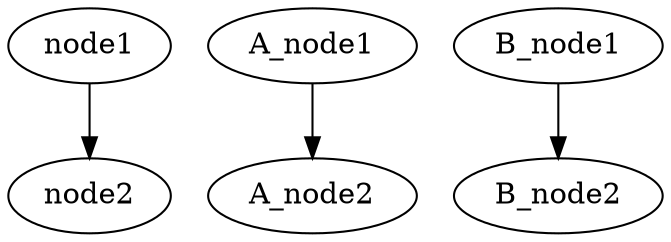

[](https://github.com/ts-graphviz/deno)

[](https://doc.deno.land/https/deno.land/x/graphviz/mod.ts)
[](https://opensource.org/licenses/MIT)
[](http://makeapullrequest.com)
[](https://github.com/denoland/deno)
[](https://nest.land/package/graphviz)

# graphviz

[Graphviz](https://graphviz.gitlab.io/) library for Deno🦕

> Runtime independent APIs and specifications are compatible with the [ts-graphviz](https://github.com/ts-graphviz/ts-graphviz) package.

## Usages

### Callback style

`renderDot` function outputs the dot command execution result to the specified path by supplying diagram object.

> `renderDot` function requires `allow-write`, `allow-run` permission, and [dot](https://graphviz.gitlab.io/) command.

```typescript
import * as path from "https://deno.land/std/path/mod.ts";
import { digraph, attribute, renderDot } from "https://deno.land/x/graphviz/mod.ts";

const G = digraph("G", (g) => {
  const a = g.node("aa");
  const b = g.node("bb");
  const c = g.node("cc");
  g.edge([a, b, c], {
    [attribute.color]: "red",
  });
  g.subgraph("A", (A) => {
    const Aa = A.node("Aaa", {
      [attribute.color]: "pink",
    });
    const Ab = A.node("Abb", {
      [attribute.color]: "violet",
    });
    const Ac = A.node("Acc");
    A.edge([Aa.port({ compass: "c" }), Ab, Ac, "E"], {
      [attribute.color]: "red",
    });
  });
});

const __dirname = new URL(".", import.meta.url).pathname;
await renderDot(G, path.resolve(__dirname, "./example.svg"), {
  format: "svg",
});
```

### Script Style

Convert the diagram object to dot format with toDot function.

```typescript
import { digraph, toDot } from "https://deno.land/x/graphviz/mod.ts";

const g = digraph("G");

const subgraphA = g.createSubgraph("A");
const nodeA1 = subgraphA.createNode("A_node1");
const nodeA2 = subgraphA.createNode("A_node2");
subgraphA.createEdge([nodeA1, nodeA2]);

const subgraphB = g.createSubgraph("B");
const nodeB1 = subgraphB.createNode("B_node1");
const nodeB2 = subgraphB.createNode("B_node2");
subgraphA.createEdge([nodeB1, nodeB2]);

const node1 = g.createNode("node1");
const node2 = g.createNode("node2");
g.createEdge([node1, node2]);

const dot = toDot(g);
console.log(dot);
```



## License

This software is released under the MIT License, see [LICENSE](./LICENSE).
