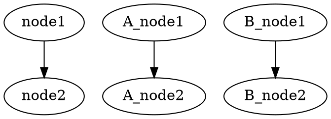
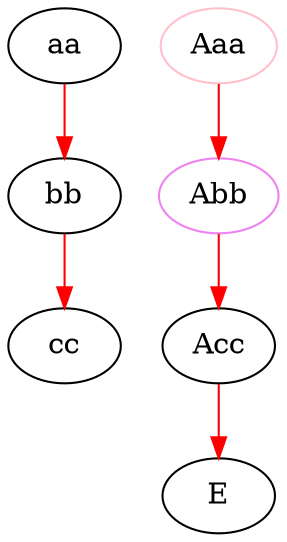
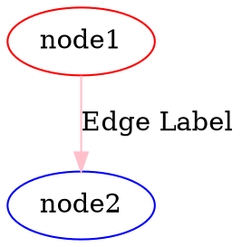
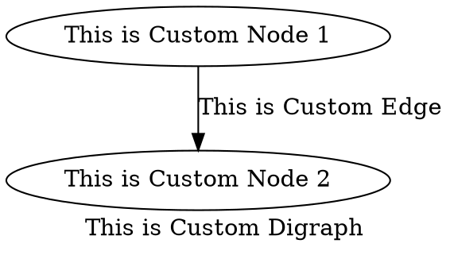

 [](https://doc.deno.land/https/deno.land/x/graphviz/mod.ts) [](https://opensource.org/licenses/MIT) [](http://makeapullrequest.com)

# graphviz

[Graphviz](https://graphviz.gitlab.io/) library for Deno🦕

## Usages

### Script style

```typescript
import { digraph, toDot } from "https://deno.land/x/graphviz/mod.ts";

const g = digraph("G");

const subgraphA = g.createSubgraph("A");
const nodeA1 = subgraphA.createNode("A_node1");
const nodeA2 = subgraphA.createNode("A_node2");
subgraphA.createEdge([nodeA1, nodeA2]);

const subgraphB = g.createSubgraph("B");
const nodeB1 = subgraphB.createNode("B_node1");
const nodeB2 = subgraphB.createNode("B_node2");
subgraphA.createEdge([nodeB1, nodeB2]);

const node1 = g.createNode("node1");
const node2 = g.createNode("node2");
g.createEdge([node1, node2]);

const dot = toDot(g);
console.log(dot);
```



### Callback style

```typescript
import { digraph, attribute, toDot } from "https://deno.land/x/graphviz/mod.ts";

const G = digraph("G", (g) => {
  const a = g.node("aa");
  const b = g.node("bb");
  const c = g.node("cc");
  g.edge([a, b, c], {
    [attribute.color]: "red",
  });
  g.subgraph("A", (A) => {
    const Aa = A.node("Aaa", {
      [attribute.color]: "pink",
    });

    const Ab = A.node("Abb", {
      [attribute.color]: "violet",
    });

    const Ac = A.node("Acc");
    A.edge([Aa.port("a"), Ab, Ac, "E"], {
      [attribute.color]: "red",
    });
  });
});

const dot = toDot(G);

console.log(dot);
```



### Class base API

```typescript
import {
  Digraph,
  Subgraph,
  Node,
  Edge,
  attribute,
  toDot,
} from "https://deno.land/x/graphviz/mod.ts";

const G = new Digraph();
const A = new Subgraph("A");
const node1 = new Node("node1", {
  [attribute.color]: "red",
});
const node2 = new Node("node2", {
  [attribute.color]: "blue",
});
const edge = new Edge([node1, node2], {
  [attribute.label]: "Edge Label",
  [attribute.color]: "pink",
});

G.addSubgraph(A);
A.addNode(node1);
A.addNode(node2);
A.addEdge(edge);

const dot = toDot(G);
console.log(dot);
```



### Custom Classes

```typescript
import {
  Digraph,
  Node,
  Edge,
  EdgeTarget,
  attribute,
  toDot,
} from "https://deno.land/x/graphviz/mod.ts";

class MyCustomDigraph extends Digraph {
  constructor() {
    super("G", {
      [attribute.label]: "This is Custom Digraph",
    });
  }
}

class MyCustomNode extends Node {
  constructor(id: number) {
    super(`node${id}`, {
      [attribute.label]: `This is Custom Node ${id}`,
    });
  }
}

class MyCustomEdge extends Edge {
  constructor(targets: ReadonlyArray<EdgeTarget>) {
    super(targets, {
      [attribute.label]: "This is Custom Edge",
    });
  }
}

const digraph = new MyCustomDigraph();
const node1 = new MyCustomNode(1);
const node2 = new MyCustomNode(2);
const edge = new MyCustomEdge([node1, node2]);

digraph.addNode(node1);
digraph.addNode(node2);
digraph.addEdge(edge);

const dot = toDot(digraph);
console.log(dot);
```



## License

This software is released under the MIT License, see [LICENSE](./LICENSE).
